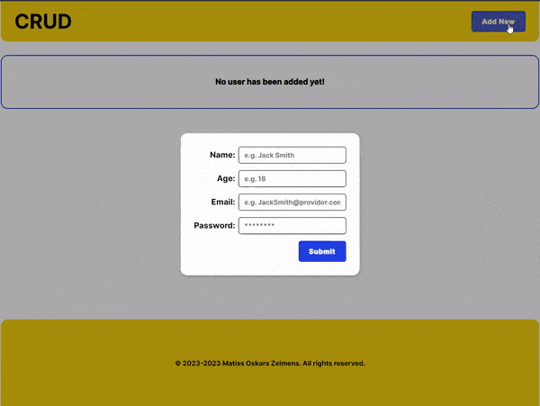

# Demo of the app

## Initial time for completion ~8h

## Technology used

- ReactJS / Typescript
- React Query
- Sass
- NodeJS
- ExpressJS
- MySQL

## Running project

Client and Server should both be run simultaneously. 

### Running Server

1. You will need docker `https://www.docker.com/`
2. Run these in your terminal to set-up mysql container (in shown order)
- `docker pull mysql/mysql-server:8.0`
- `docker run --name=mysql1 -p 3306:3306 -e MYSQL_ROOT_PASSWORD=123456 -e  MYSQL_ROOT_HOST=% -d mysql/mysql-server:8.0`
3. Now you want to create database with name `crud`
4. See `createTable.sql` for command to create table 
5. To start run these in the root folder (in shown order)
- `npm install` 
- `npm run start:nodemon`
After you can remove the container with `docker rm mysql1`

### Running Client
1. To start run these in the root folder (in shown order)
- `npm install` 
- `npm run dev`

## What to add in the near future

1. Validation on server and client side
2. Ability to view password as text and as password in input
